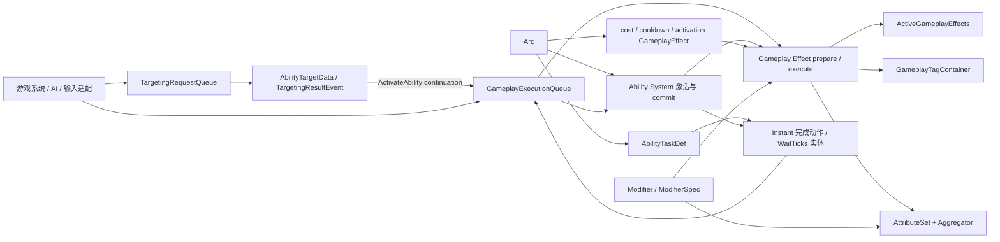

# 01 — 项目与架构总览

## 项目定位

`bevy_tools` 是面向 Bevy 0.19 的 ECS-first Gameplay Ability System。它提供构建 RPG、MOBA、
ARPG 等 Gameplay 规则所需的基础能力，但不替游戏决定输入映射、动画、表现层、网络同步或资源
序列化格式。

设计优先级是：

1. 正确性；
2. 可读性与长期维护性；
3. 经 profiling 证明有价值的性能优化；
4. 可观察且尽量确定的 fixed-tick Gameplay 语义；
5. 最少的第三方依赖。

## 领域边界

| 领域 | 拥有的概念 | 不负责 |
| --- | --- | --- |
| Gameplay Tags | 层级 Tag、位集、注册和引用计数容器 | Effect 生命周期和 Ability 激活 |
| Attributes | Attribute ID、冷热存储、聚合器、快照和重算 | Modifier 何时生效 |
| Modifiers | 修改操作、幅度求值接口、求值结果和来源 ID | Effect 持续时间与 Attribute 存储 |
| Gameplay Effects | Effect 定义、应用计划、活跃效果、堆叠、免疫和条件收敛 | 技能实例生命周期 |
| Gameplay Abilities | Ability 定义、规格、激活上下文、活跃实例和任务定义 | ASC 的授予索引和统一请求调度 |
| Ability System | ASC、激活校验、cost/cooldown commit、结束和取消 | 通用目标搜索 |
| Targeting | 可验证的选择/过滤/排序管线和目标结果 | Effect 应用与 Ability 规则判断 |
| Gameplay Execution | Ability/Effect 共用的跨类型 FIFO 和 batch resolver | 定义具体 Gameplay 规则 |
| Runtime Plugin | Resource 安装和 `FixedUpdate` 阶段排序 | 游戏侧请求生产策略 |

实际文件和子模块所有权集中记录在
[17 — 源码布局与维护边界](./17-source-layout-and-maintenance.md)，本页不重复私有文件细节。

## ECS 数据所有权

完整 Gameplay Actor 使用 `GameplayAbilitySystemBundle` 显式组合四个彼此独立的 Component：

| Component | 持有的数据 |
| --- | --- |
| `AbilitySystemComponent` | 已授予的 `GameplayAbilitySpec`、Handle 索引和 Ability 阻止状态 |
| `GameplayTagContainer` | 当前拥有 Tag 的层级位集与每个位的引用计数 |
| `AttributeSet` | 已初始化属性、稀疏 Aggregator 和 hot/cold dirty 位图 |
| `ActiveGameplayEffects` | 目标当前持有的 Duration/Infinite Effect 稳定槽位 |

`GameplayTagContainer` 和 `AttributeSet` 可以单独挂载；它们不会反向安装
`ActiveGameplayEffects`。Bundle 也不会注册 Tag/Attribute ID、初始化具体属性值或授予技能，这些
仍由游戏初始化系统显式完成。

以下运行时状态不放进 Bundle：

- `ActiveGameplayAbility`：一次活跃技能实例，存在于独立运行时实体；
- `AbilityTask`：需要跨 tick 等待的任务实体；
- `AttributeSetSnapshot`：按玩法需要显式捕获和挂载的来源属性快照；
- 全局注册表、队列和内部同步状态：由 Plugin 作为 Resource 安装。

## 定义与运行时数据流



图中的箭头表示主要运行时数据流，不等同于 Rust 模块的每一条编译依赖。同步
`try_activate_ability_by_handle()` / `apply_gameplay_effect()` API 可以绕过全局 FIFO；常规运行时
生产者应优先写入 `GameplayExecutionQueue`，以保留跨类型顺序。

## FixedUpdate 管线

`GameplayAbilitySystemRuntimePlugin` 配置以下稳定阶段：

```text
EffectTicks
  → AbilityTasks
  → RequestProducers
  → Targeting
  → PreGameplayConvergence
  → GameplayResolve
  → UpdateEffectTagRequirements
  → Cleanup
  → RecalculateAttributes
```

关键边界：

- `EffectTicks` 内部按 Duration → Requirement → Period → Requirement 串行执行；
- `AbilityTasks`、`RequestProducers`、`Targeting` 在 resolver 前产生的 Gameplay 请求可以在当前
  fixed tick 消费；
- `GameplayResolve` 完整 drain Ability/Effect 共用 FIFO，包括 drain 期间直接追加的有限请求；
- resolver 之后才入队的请求属于下一 fixed tick；
- Effect Requirement 在 tick、执行前后设置收敛点；
- Cleanup 先结束 Ability，最后才统一重算仍为 dirty 的 Attribute。

精确时序和 Observer/deferred command 边界分别见
[02 — 插件系统与生命周期](./02-plugins-and-lifecycle.md) 与
[16 — Gameplay 执行模块](./16-gameplay-execution.md)。

## 公共 API 层次

```rust
// Common integration surface.
use bevy_tools::prelude::*;

// Complete domain surface.
use bevy_tools::gas::gameplay_effects::{
    GameplayEffectApplicationError,
    prepare_gameplay_effect,
};
```

- `bevy_tools::prelude` 有意保持精简；
- `bevy_tools::gas::<domain>` 是按领域查找完整 API 的规范位置；
- crate root 继续显式重导出现有 API，以降低迁移成本；
- 私有实现文件不是稳定导入路径，公开项由同名领域门面显式控制。

## 核心不变量

1. **Tick 计时**：Effect duration、period 和 task wait 都以 `FixedUpdate` tick 表示；
2. **显式组合**：完整 GAS Actor 使用 Bundle，低层 Component 保持可独立使用；
3. **跨类型顺序**：Ability activation 与 Effect application 共享一个 FIFO；
4. **请求间可见性**：同 batch 较早请求产生的 Active Effect、Tag 和 Attribute 变化对后续请求可见；
5. **引用计数 Tag**：重叠授予和移除不会互相误清理；
6. **带世代句柄**：Active Effect slot 复用不会让旧 Handle 命中新 Effect；
7. **脏位图重算**：Attribute 只重算被标记的 hot/cold slot；
8. **确定性顺序**：需要顺序时显式排序，不依赖 HashMap 或 Bevy 并行调度的偶然顺序；
9. **共享不可变定义**：Effect/Ability 定义使用 `Arc`，运行时规格与状态独立保存；
10. **具体错误**：外部输入、容量、配置和 ECS 状态失败返回 `Result`，不依赖 panic。

## 下一步阅读

- 接入 Plugin 与阶段：[02 — 插件系统与生命周期](./02-plugins-and-lifecycle.md)
- 创建完整 Gameplay Actor：[09 — 技能系统组件](./09-ability-system-component.md)
- 理解 Effect 结算：[06 — Gameplay 效果](./06-gameplay-effects.md)
- 理解统一 FIFO：[16 — Gameplay 执行模块](./16-gameplay-execution.md)
- 查找实际目录和修改位置：[17 — 源码布局与维护边界](./17-source-layout-and-maintenance.md)
